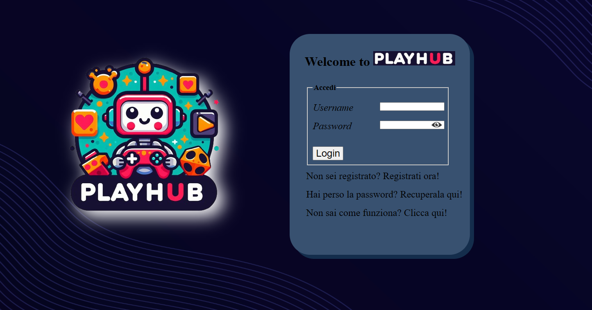

# playHub



## Descrizione
Progetto sviluppato per il corso di Progettazione Web dell'Università di Pisa.

E' una piattaforma per giocare a semplici giochi contro il computer!

Giochi inclusi:
* **Tic Tac Toe**
* **Impiccato**
* **Sasso Carta Forbici**

Include sia un servizio di registrazione, login e recupero credenziali che il tracciamento delle ultime partite effettuate.

## Tecnologie Utilizzate
* **Front-end:** HTML5, CSS3, JavaScript, PHP
* **Back-end:** PHP
* **Database:** MySQL

## Struttura del progetto
```
/
├── css/                            # files css per le pagine generali
│   └── giochi/                     # files css per le pagine dei giochi
├── html/                           # contiene due pagine contenenti il manuale e il pageNotFound
├── img/                            # contiene le immagini usate nelle pagine generali del sito
│   └── giochi/                     # contiene le immagini utilizzate nei giochi specifici
│       └── impiccato/              
│       └── sasso carta forbici/ 
│       └── tictactoe/ 
├── js/                             # script front-end
├── mysql/                          # contiene il .sql del database
├── php/                            
│   └── giochi/                     # script per ciascun gioco
│   └── requests/                   # script back-end
│   └── utility/                    # contiene il file di configurazione del database
├── index.php                       # pagina principale della piattaforma
├── credenziali.txt                 # contiene delle credenziali di accesso di prova
└── README.md
```

## Installazione e Configurazione locale

Per testare questo progetto in locale, assicurati di avere installato un ambiente server come XAMPP, MAMP o soluzioni simili.

1. **Clona la repository** all'interno della cartella pubblica del tuo server (es. `htdocs` per XAMPP):
   
```bash
   git clone https://github.com/coppola-giuseppe/PWeb_Project.git
```

2. **Configurazione del Database**
    
    Usando come esempio XAMPP, avvia i moduli Apache e MySQL dal pannello di controllo di XAMPP.

    Apri il browser e vai all'indirizzo:
    ```bash
    http://localhost/phpmyadmin
    ```

    Crea un nuovo database vuoto e chiamalo **playHub**.    

    Seleziona il database appena creato, vai nella scheda *"Importa"* e carica il file *database.sql* che trovi nella cartella *mysql/* del progetto.

3. **Naviga** all'interno della cartella del progetto fino a *php/utility/*.

    Troverai un file chiamato *dbparams.example.php*. Rinominalo oppure fanne una copia chiamandola **dbparams.php**.

    Apri il nuovo file dbparams.php con un editor di testo e inserisci le credenziali del tuo database locale.
    
4. **Apri il browser** e digita:
    ```bash
    http://localhost/PWeb_Project
    ```
